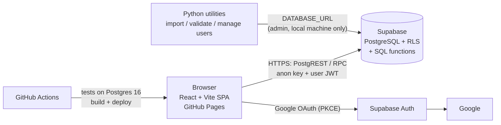

# Architecture



The whole system costs nothing to run: GitHub Pages and the Supabase Free Tier. There is no separate backend server and no Edge Function. Every privileged operation is a PostgreSQL function with its own authorization check, so there is nothing that needs a server-side secret.

## Responsibilities

| Layer | Does | Never does |
|---|---|---|
| **PostgreSQL** (operational source of truth) | authorization (RLS), validation, all money and stock calculations, transactions and row locks, audit trail, reporting aggregates | trust values from the client for prices, costs, rates or quantities-on-hand |
| **React app** | screens, forms, immediate validation feedback, display formatting | money arithmetic, permission decisions (it only hides controls) |
| **Python** | read and validate the Excel workbook, import, compare Excel against the database, manage the allow-list | run in the browser or CI with production credentials |

## Frontend structure

```text
src/
  App.tsx                 routes (HashRouter, lazy-loaded pages)
  components/             Layout, DataTable, Pagination, Modal, ConfirmDialog, Toast, ui (badges, fields, cards)
  features/
    auth/                 AuthProvider (session + allow-list check), AuthGate
    partners/             Partner Rule Table
    inventory/            Kali Inventory List
    stock/                Stock Master, stock forms, history
    sales/                Sales Log, sale form (live DB preview)
    reports/              Partner Summary, expenses panel
    admin/                users, price alerts, settings, expense items, audit log
    export/               Excel export (original workbook layout, static values only)
  hooks/                  useLoader (race-free loading), useDebouncedValue, useTableState
  lib/                    supabase client, errors, format, dates, numbers, search, navigation
  services/               one module per domain; all Supabase calls live here
  types/database.ts       row types for tables, views and RPCs
```

## Key design decisions

1. **Stock Master rows are purchase batches**, as in Excel, grouped under products. This keeps the cost and price of each delivery separate.
2. **Per-transaction sales** (header + lines), each line storing the full calculation snapshot. The August Excel log is imported as one monthly aggregate sale.
3. **One calculation, in SQL** (`calculate_sale_line`). The sale form previews through `preview_sale_line`, so no rule logic is duplicated in TypeScript.
4. **Effective-dated partner rules**, so rate changes never rewrite history.
5. **Expenses as data** (categories + monthly records with recurring and bill-share options) instead of hard-coded rental, electricity and wages.
6. **HashRouter + PKCE OAuth.** GitHub Pages cannot rewrite deep links, and PKCE returns `?code=`, which does not collide with hash routes.
7. **Server-side pagination, filtering and aggregation** everywhere. The browser never downloads whole tables.
