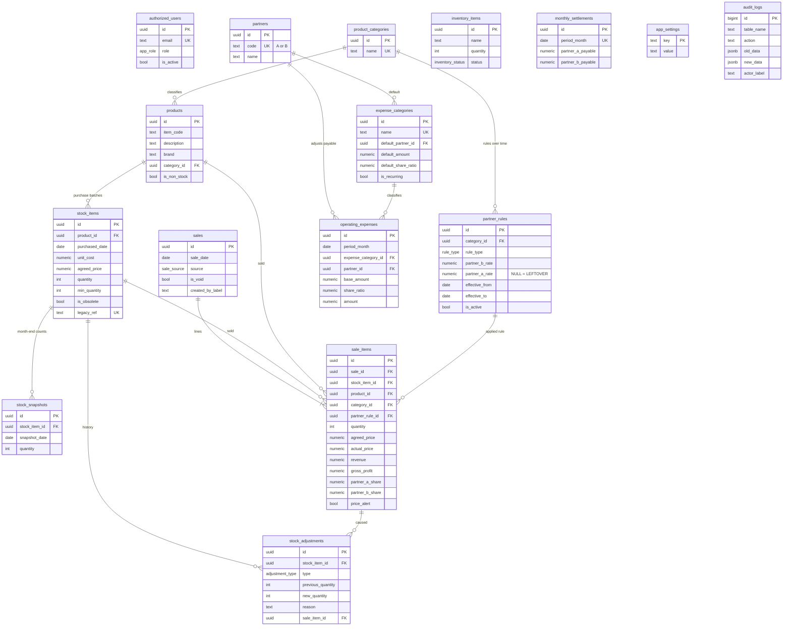

# Database schema

PostgreSQL on Supabase. All schema changes are migrations in [`supabase/migrations/`](../supabase/migrations/):

| Migration | Contents |
|---|---|
| `…001_foundation` | private schema, enums, `authorized_users`, auth helpers, `app_settings`, `audit_logs` |
| `…002_catalog_and_stock` | partners, categories, partner rules, products, stock items, stock history, inventory, stock functions |
| `…003_sales` | sales, sale lines, `calculate_sale_line`, preview/create/void sale, `sales_log_view` |
| `…004_settlement` | expense categories, operating expenses, monthly settlements, reporting functions |
| `…005_security` | RLS on every table, least-privilege and column-level grants |
| `…006_bootstrap_admin` | first administrator (`kalimotormalihah@gmail.com`) |
| `…007_foreign_key_indexes` | indexes for four foreign keys flagged by the Supabase advisor |
| `…008_sale_line_void_and_business_date` | `sale_items.is_void/voided_*/void_reason`, `void_sale_item()`, reports exclude void lines, `private.business_today()` (Asia/Kuala_Lumpur) |
| `…009_stock_auto_obsolete_and_fifo` | `stock_items.obsolete_remarks`, auto-obsolete trigger, `stock_items_view.fifo_rank/active_batch_count` ([stock-rules.md](stock-rules.md)) |
| `…010_telegram` | `telegram_user_links`, `telegram_link_codes`, `telegram_sessions`, `telegram_processed_updates`, link-code functions, `tg_*` bot functions, acting-user support ([telegram-integration.md](telegram-integration.md)) |
| `…011_sales_analytics` | `analytics_monthly`, `analytics_categories`, `analytics_items` ([sales-analytics.md](sales-analytics.md)) |

Conventions:
- UUID primary keys (the audit log uses an identity column).
- Money is `numeric(12,2)`, rates are `numeric(12,4)`, quantities are `integer`.
- `created_at` / `updated_at` / `created_by` / `updated_by` are set by triggers, so clients cannot spoof them.
- CHECK constraints guard formats and invariants.

## ERD

## Tables

| Table | Purpose | Key constraints |
|---|---|---|
| `authorized_users` | Allow-list of Google accounts, role, active flag | email lower-case and unique; one entry per Gmail mailbox (dots ignored); last active admin cannot be removed |
| `app_settings` | Typed configuration (low-stock default, price alert threshold, negative stock) | value must match its type |
| `partners` | Partner A (KaLi Motor), Partner B (Amin) | code ∈ {A, B} |
| `product_categories` | Excel "Product Type" | case-insensitive unique |
| `partner_rules` | Effective-dated rule per category | no overlapping active rules; LEFTOVER ⇔ NULL A rate; Shared_50 ⇒ rates 0.5 |
| `products` | SKU (code + description + brand + category) | unique identity |
| `stock_items` | Stock_Master row / purchase batch | cost and price ≥ 0; quantity ≥ 0 unless allowed; obsolete ⇔ `obsolete_at` |
| `stock_adjustments` | Immutable quantity history | `quantity_change` generated; reason required |
| `stock_snapshots` | Imported month-end counts | unique (item, date) |
| `inventory_items` | Shared workshop equipment | quantity ≥ 0 |
| `sales` | Sale header (date, source, void info, seller) | void needs reason |
| `sale_items` | Sale line with full calculation snapshot | revenue = price × qty; cost = unit cost × qty; GP = revenue − cost; A + B = revenue |
| `expense_categories` | Wages, electricity, rental… | recurring ⇒ fixed amount and partner |
| `operating_expenses` | Signed monthly adjustment to a partner's payable | amount = bill × ratio when a bill is given (computed by trigger) |
| `monthly_settlements` | Finalized month snapshot (row present = locked) | one per month |
| `audit_logs` | Before/after JSON of every change to audited tables | written by triggers only |
| `telegram_user_links` | Telegram user ID ↔ allow-listed user | Telegram ID unique; one active link per user; admin deactivation blocks relinking |
| `telegram_link_codes` | One-time link codes (SHA-256 hash only) | expire after 10 minutes; single use |
| `telegram_sessions` | Bot conversation state and pending confirmation | service role only |
| `telegram_processed_updates` | Telegram `update_id`s already processed (kept 7 days) | primary key = update ID |

Columns added by the enhancement:
- `sale_items`: `is_void`, `voided_at`, `voided_by`, `voided_by_label` and `void_reason` (line-level void; `is_void ⇔ voided_at`, and a reason is required).
- `stock_items`: `obsolete_remarks` (`auto-rule obsolete` / `manual`).

## Views and functions

| Name | Kind | Purpose |
|---|---|---|
| `stock_items_view` | view (security invoker) | stock with product, category, effective minimum and **status** |
| `sales_log_view` | view (security invoker) | one row per sale line with product and category |
| `calculate_sale_line` | immutable function | the Excel calculation |
| `price_drop_check` | immutable function | drop ratio and alert flag |
| `preview_sale_line` | function | calculation for the UI without writing |
| `create_sale` / `void_sale` | SECURITY DEFINER | transactional sale and stock update / admin void |
| `add_stock_item` / `adjust_stock` / `set_stock_min_quantity` / `set_stock_obsolete` | SECURITY DEFINER | stock changes with history |
| `partner_summary_by_category`, `settlement_summary`, `dashboard_stats` | functions (invoker) | reporting, filtered and aggregated in the database |
| `apply_recurring_expenses`, `finalize_settlement`, `reopen_settlement` | SECURITY DEFINER, admin | month-end |
| `get_my_access` | SECURITY DEFINER | caller's allow-list entry (empty if unauthorized) |
| `void_sale_item` | SECURITY DEFINER, admin | void one sale line and return only its stock |
| `analytics_monthly`, `analytics_categories`, `analytics_items` | functions (invoker), admin | sales analytics |
| `create_telegram_link_code`, `get_my_telegram_link`, `unlink_my_telegram` | SECURITY DEFINER, signed-in users | Telegram linking |
| `tg_claim_update`, `tg_link_account`, `tg_whoami`, `tg_list_categories`, `tg_list_products`, `tg_list_batches`, `tg_preview_sale`, `tg_execute` | SECURITY DEFINER, **service_role only** | bot operations; act as the linked user, then call the functions above |
| `private.business_today()` | helper | today in Asia/Kuala_Lumpur |
| `private.apply_auto_obsolete(product)` | helper (trigger) | auto-obsolete rule |

## Indexes

Foreign keys and filter columns are indexed:
- product/category/item code
- `stock_items(product_id)`, `stock_items(is_obsolete)`
- `sale_items(sale_id, stock_item_id, product_id, category_id, partner_rule_id)`
- a partial index on `sale_items(price_alert)`
- `sales(sale_date)`, `sales(created_by)`
- `partner_rules(category_id, effective_from)`
- `stock_adjustments(stock_item_id, created_at)`
- `operating_expenses(period_month)`
- `audit_logs(table_name, record_id)` and `audit_logs(occurred_at)`

All list screens paginate and filter in the database. No materialized views are needed at this data volume.

### Index decisions (October 2026 enhancement)

| Index | Why |
|---|---|
| `stock_items(product_id, purchased_date, created_at)` | FIFO ordering and the auto-obsolete rule both scan one product's batches by purchase date |
| `sale_items(sale_id) WHERE NOT is_void` | reports and analytics read only non-void lines of sales already filtered by `sales(sale_date)` |
| `telegram_user_links(telegram_user_id)` (unique) + partial unique `(authorized_user_id) WHERE is_active` | every bot update looks up the Telegram ID; one active link per user |
| `telegram_processed_updates(processed_at)` | cleanup of entries older than 7 days |
| `telegram_link_codes(code_hash)` (unique), `(authorized_user_id)` | code lookup on /start; revoking a user's previous codes |

Considered and not added:
- **A standalone index on `sale_items(is_void)`:** a low-cardinality boolean; the partial index above covers the real queries.
- **An index on `stock_items(is_obsolete)`:** it already exists.
- **An index for status:** status is computed in the view, not stored.
