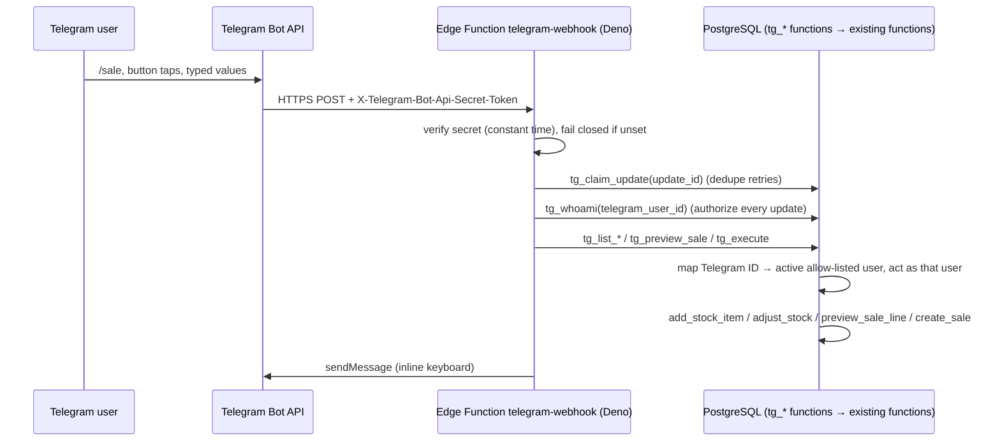

# Telegram integration

Users and admins can add stock, adjust stock and record sales from Telegram. The bot uses the **same database functions, permissions and calculations** as the web app.

## Architecture



- **GitHub Pages holds no Telegram secrets.** The bot token lives only in Supabase Edge Function secrets.
- The function talks to the database with the **service role**, which Supabase injects automatically. It can only *act as* a user through `tg_*` functions, which first resolve the Telegram user ID to an **active link** of an **active allow-listed user**.
- `private.current_email()` honours that "acting user" **only for service-role requests**. A browser session cannot use it; this is tested.
- Every stock and sale change runs through the existing `add_stock_item`, `adjust_stock` and `create_sale` functions. Previews run through `preview_sale_line` → `calculate_sale_line`. **There is no Telegram-specific calculation.**

## Linking a Telegram account

```text
Web app (signed in) → Telegram → "Link my Telegram account"
   → create_telegram_link_code(): random 64-hex code, valid 10 minutes, single use
     (only a SHA-256 hash is stored; any earlier unused code is revoked)
   → user opens https://t.me/<bot>?start=<code> (or sends /start <code>)
   → tg_link_account(): validates the hash, expiry and single use, user active,
     not blocked → stores the numeric Telegram user ID (never trusts the username)
```

- One Telegram account per user, and one user per Telegram account. Linking again replaces the old link.
- Users can unlink themselves (header → Telegram).
- **Admins** can deactivate or reactivate any link under **Admin → Telegram**. A deactivated link is a **block**: the user cannot create a new code or relink until an admin reactivates it, and that Telegram account cannot be linked to anyone else.
- Disabling a user under **Admin → Users** immediately blocks their Telegram access too.

## Commands

The commands appear in Telegram's menu (registered by `telegram_setup.py`).

| Command | What it does |
|---|---|
| `/start <code>` | link this Telegram account |
| `/sale` | record a sale: item → batch (FIFO) → sale date → quantity → actual price → database preview → confirm |
| `/stock_add` | add a new purchase batch of an existing item: category → item → purchase date → quantity → cost → agreed price → confirm |
| `/stock_adjust` | receive / stock check / correct: item → batch (FIFO) → type → quantity → reason → confirm |
| `/stock <text>` | read-only stock lookup |
| `/whoami`, `/help`, `/cancel` | |

How the bot handles input:
- **Buttons over typing:** inline keyboards are used wherever values exist in the database (categories, items, batches, today/yesterday, last cost, current price, agreed price). Typing is only for quantities, new prices, dates and reasons, and all of these are validated.
- **Item lookup:** you can tap a category or type part of an item code or name.
- **FIFO:** batches are listed oldest purchase first (⭐). Any batch can be chosen explicitly.
- **Price alert:** the confirmation shows the same alert as the web app (actual ≤ agreed × (1 − threshold), default 10%), using the database's drop ratio.
- **Success messages** are sent only after the database transaction commits, e.g. "Sale successfully recorded. Sales ID: AB12CD34. Stock remaining: 3".
- **New products** (new item codes) are created in the web app. Telegram adds batches of existing items.
- **Private chats only.** The bot refuses group chats, so financial data is never posted to a group.
- **Bot alias:** the bot username is configurable. It's set in the web app (Admin → Settings → `telegram_bot_username`, used for the link) and in the function secret `TELEGRAM_BOT_USERNAME`. Commands addressed to a different bot (`/sale@OtherBot`) are ignored.

## Safety mechanisms

| Risk | Control |
|---|---|
| Stranger finds the bot | Every update is authorized by `tg_whoami`. Unlinked users only see how to link. |
| Forged or old buttons | Buttons carry a random per-step nonce + an index into options stored **server-side** (`telegram_sessions`). Mismatches are rejected. |
| Double tap / Telegram retry | `tg_claim_update` processes each `update_id` once. `tg_execute` consumes the pending action **atomically with the write** and returns `already_done` for repeats. |
| Expired interaction | Sessions expire 15 minutes after the last step. |
| Stale stock | Adjustments send the quantity shown; the database refuses the change if it moved meanwhile. Sales re-check stock at commit. The preview re-checks before confirming. |
| Raw errors | Only our own validation messages are shown; everything else becomes "Something went wrong. Nothing was saved." |
| Token leakage | The token is used only in the outbound request URL. It is never logged and never returned. The setup script never prints it. |

## Setup

1. **Create the bot:** in Telegram, talk to **@BotFather** → `/newbot`. Copy the **token** and the **username**.
2. **Generate a webhook secret** (from the `python` folder):
   ```bash
   python scripts/telegram_setup.py secret
   ```
3. **Set Supabase secrets** (Dashboard → Edge Functions → Secrets, or the CLI):
   ```bash
   supabase secrets set TELEGRAM_BOT_TOKEN=<token> TELEGRAM_WEBHOOK_SECRET=<secret> TELEGRAM_BOT_USERNAME=<bot username>
   ```
4. **Deploy the function with JWT verification off.** Telegram cannot send a Supabase JWT; the secret header authenticates instead:
   ```bash
   supabase functions deploy telegram-webhook --no-verify-jwt
   ```
5. **Register the webhook and the command menu:**
   ```bash
   # PowerShell: $env:TELEGRAM_BOT_TOKEN="..."; $env:TELEGRAM_WEBHOOK_SECRET="..."; $env:SUPABASE_PROJECT_REF="sywmicrngyvojjdayhhc"
   python scripts/telegram_setup.py webhook
   python scripts/telegram_setup.py info      # url set, no last_error_message
   ```
6. **Set the alias in the web app:** Admin → Settings → *Telegram bot username* (without @).
7. Each user links once: header → **Telegram** → **Link my Telegram account**.

The function returns **503** until all secrets are set, and **401** for requests without the correct secret header.

## Troubleshooting

| Symptom | Check |
|---|---|
| Bot does not answer | `telegram_setup.py info`: `last_error_message`; Supabase → Edge Functions → telegram-webhook → Logs |
| 401 in Telegram's webhook info | the secret passed to `setWebhook` differs from `TELEGRAM_WEBHOOK_SECRET` |
| 503 | a secret is missing |
| "not linked" | link again from the web app (code valid 10 minutes, single use) |
| "access is disabled" | user or link deactivated by an administrator |
